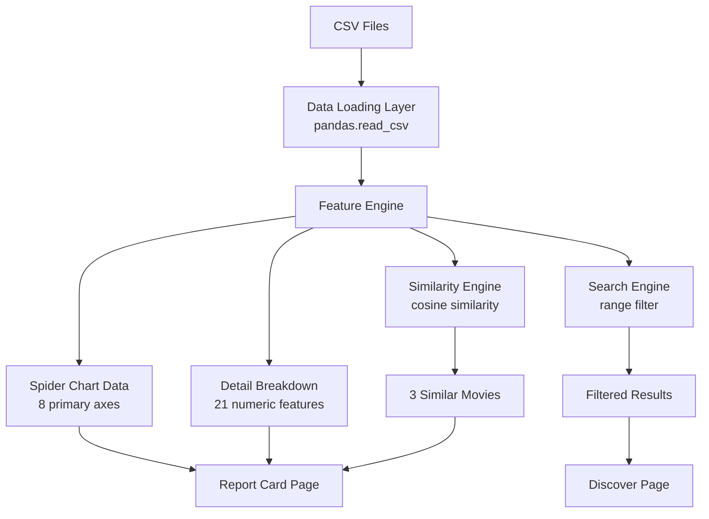

# Cinatomy — Movie Report Card & Discovery App

> **Design Document** — OODA Analysis & UI/UX Blueprint
> Created: 2026-06-14 | Skill Sources: `ui-ux-pro-max`, `brainstorming`, `writing-plans`

---

## OODA Phase 1: OBSERVE — What We Know

### 1.1 Data Inventory

| Dataset | File | Rows | Key Fields |
|---------|------|------|------------|
| Movie Profiles | `data/cinatomy_movie_profiles.csv` | 1,000 | 27 columns: `movie_title` + 26 feature scores |
| IMDB Metadata | `data/imdb_top_1000.csv` | 1,000 | Poster, title, year, cert, runtime, genre, IMDB rating, overview, metascore, director, stars, votes, gross |
| Overviews | `data/movie_overviews.csv` | 1,000 | `Series_Title`, `Overview` |

### 1.2 Feature Columns (26 total, from `cinatomy_movie_profiles.csv`)

**Numeric Score Features (1-5 scale):**

| # | Feature | Spider-Friendly Name |
|---|---------|---------------------|
| 1 | `pacing_efficiency` | Pacing |
| 2 | `originality` | Originality |
| 3 | `family_friendly` | Family Friendly |
| 4 | `plot_quality_rating` | Plot Quality |
| 5 | `dialogues` | Dialogues |
| 6 | `end_feeling_ending_rating` | Ending |
| 7 | `immersive` | Immersion |
| 8 | `impactful` | Impact |
| 9 | `overall_feeling` | Overall Feeling |
| 10 | `visuals` | Visuals |
| 11 | `visual_effects` | VFX |
| 12 | `sound_bgm_quality` | BGM Quality |
| 13 | `sound_song_tracks_quality` | Soundtrack |
| 14 | `performance_of_actors` | Acting |
| 15 | `connected` | Emotional Connection |
| 16 | `references_contained` | References |
| 17 | `cognitive_requirement` | Cognitive Demand |
| 18 | `technical_knowledge_required` | Technical Barrier |
| 19 | `photosensitivity_warnings` | Photosensitivity |
| 20 | `animal_harm` | Animal Harm |
| 21 | `trailer_or_spoiler` | Spoiler Risk |

**Categorical/Text Features:**

| # | Feature | Type |
|---|---------|------|
| 22 | `plot_quality_reasons_for_liking` | List of strings |
| 23 | `plot_quality_reasons_for_disliking` | List of strings |
| 24 | `end_feeling_emotional_adjective` | String (happy, bittersweet, etc.) |
| 25 | `end_feeling_structural_adjective` | String (satisfying, earned, etc.) |
| 26 | `sound_audio_balance_issue` | Boolean |

**Spider Chart Candidates** (Core features for clarity — limit 5-8 axes per UX Pro Max chart guidance):

> Per UI-UX Pro Max chart research: "⚠ Moderate — limit 5-8 axes. Add data table."

Primary Spider (8 axes): `Plot Quality`, `Acting`, `Dialogues`, `Visuals`, `Immersion`, `Impact`, `Originality`, `Pacing`

Secondary detail table: All 21 numeric features with full breakdown.

### 1.3 Enrichment Opportunity

The `movie_overviews.csv` dataset provides synopsis text, while `imdb_top_1000.csv` provides poster images, genre, director, etc. These join on `movie_title` / `Series_Title` to enrich the report card and display a comprehensive overview.

---

## OODA Phase 2: ORIENT — Design Intelligence Synthesis

### 2.1 Design System (from UI-UX Pro Max)

| Aspect | Decision | Source |
|--------|----------|--------|
| **Product Type** | Analytics Dashboard | Product domain: "Drill-Down Analytics + Comparative" |
| **Primary Style** | Dark Mode (OLED) + Data-Dense | Style domain: "Deep Black #000000, Dark Grey #121212, Midnight Blue #0A0E27" |
| **Typography** | Poppins (headings) + Open Sans (body) | Typography domain: "Modern Professional" pairing |
| **Color Palette** | Analytics Dashboard palette | Color domain (below) |
| **Chart Type** | Radar/Spider Chart | Chart domain: "Chart.js, Recharts, ApexCharts" -> Plotly (Python) |
| **Accessibility** | WCAG AAA (dark mode) | Style domain: "High readability, visible focus" |
| **Animations** | 150-300ms ease-out transitions | UX domain: "Use ease-out for entering" |

### 2.2 Color Palette

```
Primary:    #3B82F6  (Trust Blue — headers, links, primary actions)
Secondary:  #60A5FA  (Light Blue — hover states, secondary elements)
Background: #0A0E27  (Midnight Blue — dark mode base)
Surface:    #121212  (Dark Grey — cards, panels)
Text:       #F8FAFC  (Near White — primary text on dark)
Muted Text: #94A3B8  (Slate 400 — secondary labels)
Border:     #1E293B  (Slate 800 — subtle card borders)
Success:    #22C55E  (Green — high scores)
Warning:    #EAB308  (Yellow — medium scores)
Danger:     #EF4444  (Red — low scores)
```

### 2.3 Font Stack

```css
@import url('https://fonts.googleapis.com/css2?family=Open+Sans:wght@300;400;500;600;700&family=Poppins:wght@400;500;600;700&display=swap');

/* Headings: Poppins 600/700 */
/* Body: Open Sans 400/500 */
/* Data: Open Sans 600 (tabular-nums) */
```

### 2.4 UX Rules (from UI-UX Pro Max)

| Rule | Application |
|------|-------------|
| No emoji icons | Use Lucide or Heroicons SVG icons throughout |
| `cursor-pointer` on all interactive elements | Sliders, cards, buttons, tabs |
| `prefers-reduced-motion` | Wrap all transitions in media query |
| Smooth transitions (150-300ms) | Card hovers, tab switches, slider feedback |
| Z-index scale (10, 20, 30, 50) | Sidebar=10, Modals=30, Toast=50 |
| Lazy loading | Poster images load on scroll |
| Tooltips on hover | Spider chart axes, score badges |

---

## OODA Phase 3: DECIDE — Application Architecture

### 3.1 Page Architecture

```
┌─────────────────────────────────────────────┐
│              CINATOMY APP                   │
│                                             │
│  ┌─────────┐  ┌───────────────────────────┐ │
│  │ Sidebar │  │      Main Content         │ │
│  │         │  │                           │ │
│  │  Nav    │  │  Page 1: Report Card      │ │
│  │         │  │  Page 2: Discover         │ │
│  │ Movie   │  │                           │ │
│  │ Picker  │  │                           │ │
│  │         │  │                           │ │
│  └─────────┘  └───────────────────────────┘ │
└─────────────────────────────────────────────┘
```

### 3.2 Page Breakdown

#### Page 1: Movie Report Card (PRIMARY — highest priority)

```
┌──────────────────────────────────────────────────┐
│  [MOVIE_TITLE]                                   │
│  Genre • Year • Runtime • Director               │
├──────────────────────────────────────────────────┤
│                                                  │
│  ┌──────────────┐  ┌──────────────────────────┐  │
│  │              │  │     SPIDER GRAPH          │  │
│  │   Poster     │  │                           │  │
│  │   Image      │  │   8-axis radar chart      │  │
│  │              │  │   [FEATURE_NAME]:          │  │
│  │              │  │   [SCORE_VALUE]            │  │
│  │              │  │                           │  │
│  └──────────────┘  └──────────────────────────┘  │
│                                                  │
│  ┌──────────────────────────────────────────────┐│
│  │     SYNOPSIS (OVERVIEW)                      ││
│  │     [MOVIE_OVERVIEW]                         ││
│  └──────────────────────────────────────────────┘│
│                                                  │
│  ┌──────────────────────────────────────────────┐│
│  │         OVERALL SCORE BADGE                  ││
│  │         [SCORE_VALUE] / 5                    ││
│  └──────────────────────────────────────────────┘│
│                                                  │
│  ┌──────────────────────────────────────────────┐│
│  │     DETAILED FEATURE BREAKDOWN               ││
│  │                                              ││
│  │  [FEATURE_NAME]  ████████░░  [SCORE_VALUE]   ││
│  │  [FEATURE_NAME]  ██████░░░░  [SCORE_VALUE]   ││
│  │  [FEATURE_NAME]  ██████████  [SCORE_VALUE]   ││
│  │  ...                                         ││
│  │                                              ││
│  │  Sections:                                   ││
│  │  - Story & Writing (Plot, Dialogues, Ending) ││
│  │  - Craft & Production (Visuals, VFX, Sound)  ││
│  │  - Experience (Immersion, Impact, Pacing)     ││
│  │  - Accessibility (Family, Cognitive, Photo)   ││
│  └──────────────────────────────────────────────┘│
│                                                  │
│  ┌──────────────────────────────────────────────┐│
│  │     EMOTIONAL PROFILE                        ││
│  │                                              ││
│  │  Ending Emotion: [end_feeling_emotional_adj] ││
│  │  Ending Type:    [end_feeling_structural_adj]││
│  │  Plot Strengths: [reasons_for_liking]        ││
│  │  Plot Concerns:  [reasons_for_disliking]     ││
│  └──────────────────────────────────────────────┘│
│                                                  │
│  ┌──────────────────────────────────────────────┐│
│  │     3 MOST SIMILAR MOVIES                    ││
│  │                                              ││
│  │  ┌────────┐ ┌────────┐ ┌────────┐           ││
│  │  │Poster  │ │Poster  │ │Poster  │           ││
│  │  │        │ │        │ │        │           ││
│  │  │[TITLE] │ │[TITLE] │ │[TITLE] │           ││
│  │  │Match:  │ │Match:  │ │Match:  │           ││
│  │  │ 94%    │ │ 87%    │ │ 82%    │           ││
│  │  └────────┘ └────────┘ └────────┘           ││
│  └──────────────────────────────────────────────┘│
└──────────────────────────────────────────────────┘
```

#### Page 2: Discover Movies (Search Interface)

```
┌──────────────────────────────────────────────────┐
│  DISCOVER MOVIES                                 │
│  Find your next watch by tuning features         │
├──────────────────────────────────────────────────┤
│                                                  │
│  ┌──────────────────────────────────────────────┐│
│  │     FEATURE SLIDERS                          ││
│  │                                              ││
│  │  Tabs: [Core] [Craft] [Experience] [Content] ││
│  │                                              ││
│  │  [FEATURE_NAME]                              ││
│  │  Min ●━━━━━━━━━━━●━━━━━ Max                  ││
│  │        low        high                       ││
│  │  Selected: [SCORE_VALUE] - [SCORE_VALUE]     ││
│  │                                              ││
│  │  [FEATURE_NAME]                              ││
│  │  Min ━━━━━●━━━━━━━━━━● Max                   ││
│  │                                              ││
│  │  Quick Presets:                               ││
│  │  [Crowd-Pleaser] [Mind-Bender] [Visual Feast]││
│  │  [Family Night]  [Hidden Gems] [Reset All]   ││
│  └──────────────────────────────────────────────┘│
│                                                  │
│  ┌──────────────────────────────────────────────┐│
│  │     RESULTS ( N movies match )               ││
│  │                                              ││
│  │  ┌─────────┐ ┌─────────┐ ┌─────────┐        ││
│  │  │ Poster  │ │ Poster  │ │ Poster  │        ││
│  │  │         │ │         │ │         │        ││
│  │  │[TITLE]  │ │[TITLE]  │ │[TITLE]  │        ││
│  │  │         │ │         │ │         │        ││
│  │  │> Report │ │> Report │ │> Report │        ││
│  │  └─────────┘ └─────────┘ └─────────┘        ││
│  │                                              ││
│  │  ... (scrollable grid)                       ││
│  └──────────────────────────────────────────────┘│
└──────────────────────────────────────────────────┘
```

### 3.3 Data Flow



### 3.4 Similarity Algorithm

```
For a given movie M:
1. Extract numeric feature vector V_m (21 dimensions)
2. Normalize each feature to 0-1 scale (min-max across dataset)
3. Compute cosine similarity: sim(V_m, V_n) for all n != m
4. Return top-3 highest similarity scores
5. Display as percentage: similarity * 100
```

### 3.5 Search Algorithm

```
For user-selected feature ranges:
1. Each slider produces (feature, min_val, max_val)
2. Filter: movie[feature] >= min_val AND movie[feature] <= max_val
3. Apply AND logic across all active filters
4. Sort results by overall_feeling descending
5. Display as scrollable card grid
```

### 3.6 Quick Preset Definitions

| Preset | Feature Filters |
|--------|----------------|
| **Crowd-Pleaser** | `plot_quality >= 4`, `overall_feeling >= 4`, `performance_of_actors >= 4` |
| **Mind-Bender** | `cognitive_requirement >= 4`, `originality >= 4`, `plot_quality >= 4` |
| **Visual Feast** | `visuals >= 4`, `visual_effects >= 4`, `immersive >= 4` |
| **Family Night** | `family_friendly >= 3`, `photosensitivity_warnings <= 2`, `animal_harm <= 1` |
| **Hidden Gems** | `originality >= 4`, `overall_feeling >= 4`, `connected >= 4` |

---

## OODA Phase 4: ACT — Implementation Plan

> **For Antigravity:** REQUIRED WORKFLOW: Use `.agent/workflows/execute-plan.md` to execute this plan in single-flow mode.

**Goal:** Build a Streamlit app with two pages (Report Card, Discover) using dark-mode analytics dashboard styling, Plotly radar charts, and movie synopsis integration.

**Architecture:** Multi-page Streamlit app with a shared data layer (pandas), feature engine (numpy/scipy for similarity), and Plotly for charts. Custom CSS injection for dark mode + design system.

**Tech Stack:** Python 3.12, Streamlit, Pandas, NumPy, SciPy, Plotly

---

### Task 1: Project Scaffolding & Dependencies

**Files:**
- Create: `requirements.txt`
- Create: `app.py` (main entry point)
- Create: `.streamlit/config.toml`

**Step 1: Create `requirements.txt`**

```txt
streamlit>=1.38.0
pandas>=2.2.0
numpy>=1.26.0
scipy>=1.12.0
plotly>=5.18.0
```

**Step 2: Create directory structure**

```
Cinatomy/
├── app.py                    # Main entry + sidebar
├── requirements.txt
├── .streamlit/
│   └── config.toml           # Dark theme config
├── styles/
│   └── theme.css             # Custom CSS design system
├── utils/
│   ├── __init__.py
│   ├── data_loader.py        # CSV loading + join
│   ├── feature_engine.py     # Normalization + similarity
│   └── constants.py          # Feature groups, colors, presets
├── components/
│   ├── __init__.py
│   ├── spider_chart.py       # Plotly radar chart
│   ├── score_breakdown.py    # Horizontal bar breakdown
│   ├── similar_movies.py     # 3-card similarity display
│   └── movie_card.py         # Reusable movie card
├── pages/
│   ├── 1_Report_Card.py      # Page 1: Report Card
│   └── 2_Discover.py         # Page 2: Discover/Search
└── data/
    ├── cinatomy_movie_profiles.csv
    ├── imdb_top_1000.csv
    └── movie_overviews.csv
```

**Step 3: Create `.streamlit/config.toml`**

```toml
[theme]
primaryColor = "#3B82F6"
backgroundColor = "#0A0E27"
secondaryBackgroundColor = "#121212"
textColor = "#F8FAFC"
font = "sans serif"

[server]
headless = true
```

**Step 4: Install dependencies**

```bash
pip install -r requirements.txt
```

**Step 5: Run to verify scaffold**

```bash
streamlit run app.py
```

Expected: Empty app loads with dark theme.

**Step 6: Commit**

```bash
git add -A
git commit -m "feat: scaffold Cinatomy Streamlit app with dark theme"
```

---

### Task 2: Constants & Data Loader

**Files:**
- Create: `utils/constants.py`
- Create: `utils/data_loader.py`
- Create: `utils/__init__.py`

**Step 1: Create `utils/constants.py`**

Define:
- `SPIDER_FEATURES`: 8 primary features for radar chart with display names
- `ALL_NUMERIC_FEATURES`: 21 features with display names
- `FEATURE_GROUPS`: Dict grouping features into Story, Craft, Experience, Accessibility
- `COLOR_PALETTE`: Dict with all hex colors from design system
- `SCORE_COLORS`: Function mapping score (1-5) to green/yellow/red
- `QUICK_PRESETS`: Dict of preset name -> feature filter rules

**Step 2: Create `utils/data_loader.py`**

```python
@st.cache_data
def load_data():
    """Load and join movie profiles with IMDB metadata and overviews."""
    profiles = pd.read_csv("data/cinatomy_movie_profiles.csv")
    imdb = pd.read_csv("data/imdb_top_1000.csv")
    overviews = pd.read_csv("data/movie_overviews.csv")
    
    # Join on title
    merged = profiles.merge(
        imdb, 
        left_on="movie_title", 
        right_on="Series_Title", 
        how="left"
    )
    merged = merged.merge(
        overviews,
        left_on="movie_title",
        right_on="Series_Title",
        how="left"
    )
    return merged

def get_movie_list(df):
    """Return sorted list of movie titles."""
    return sorted(df["movie_title"].unique().tolist())
```

**Step 3: Write test — verify data loads and joins**

```bash
python -c "from utils.data_loader import load_data; df = load_data(); print(f'Rows: {len(df)}, Cols: {len(df.columns)}')"
```

Expected: `Rows: 1000`, appropriate number of joined columns.

**Step 4: Commit**

```bash
git add utils/
git commit -m "feat: add constants and data loader with IMDB and overview join"
```

---

### Task 3: Feature Engine (Similarity + Search)

**Files:**
- Create: `utils/feature_engine.py`

**Step 1: Implement normalization**

```python
def normalize_features(df, features):
    """Min-max normalize feature columns to 0-1."""
    result = df[features].copy()
    for col in features:
        min_val = result[col].min()
        max_val = result[col].max()
        if max_val > min_val:
            result[col] = (result[col] - min_val) / (max_val - min_val)
        else:
            result[col] = 0.5
    return result
```

**Step 2: Implement similarity**

```python
from scipy.spatial.distance import cosine

def find_similar_movies(df, movie_title, features, top_n=3):
    """Return top-N most similar movies by cosine similarity."""
    normalized = normalize_features(df, features)
    idx = df[df["movie_title"] == movie_title].index[0]
    target = normalized.loc[idx].values
    
    similarities = []
    for i, row in normalized.iterrows():
        if i != idx:
            sim = 1 - cosine(target, row.values)
            similarities.append((df.loc[i, "movie_title"], sim))
    
    similarities.sort(key=lambda x: x[1], reverse=True)
    return similarities[:top_n]
```

**Step 3: Implement search filter**

```python
def filter_movies(df, filters):
    """Filter movies by feature range sliders.
    filters: list of (feature_name, min_val, max_val)
    """
    mask = pd.Series(True, index=df.index)
    for feature, min_val, max_val in filters:
        mask &= (df[feature] >= min_val) & (df[feature] <= max_val)
    return df[mask].sort_values("overall_feeling", ascending=False)
```

**Step 4: Test similarity**

```bash
python -c "
from utils.data_loader import load_data
from utils.feature_engine import find_similar_movies
from utils.constants import ALL_NUMERIC_FEATURES
df = load_data()
features = [f[0] for f in ALL_NUMERIC_FEATURES]
similar = find_similar_movies(df, 'The Shawshank Redemption', features)
for title, sim in similar:
    print(f'{title}: {sim:.2%}')
"
```

Expected: 3 movies with similarity percentages.

**Step 5: Commit**

```bash
git add utils/feature_engine.py
git commit -m "feat: add feature engine with similarity and search filtering"
```

---

### Task 4: Custom CSS Design System

**Files:**
- Create: `styles/theme.css`

**Step 1: Create CSS with design tokens**

Include:
- Google Fonts import (Poppins + Open Sans)
- CSS custom properties for all palette colors
- Dark mode card styling with subtle borders (`#1E293B`)
- Score badge styling (color-coded by value)
- Horizontal progress bar styling for feature breakdown
- Slider styling overrides for Streamlit
- Responsive grid layouts
- `prefers-reduced-motion` media query
- Smooth transitions (200ms ease-out)
- `cursor-pointer` on interactive elements

**Step 2: Create CSS injection utility**

```python
# In app.py or a utility
def inject_css():
    with open("styles/theme.css") as f:
        st.markdown(f"<style>{f.read()}</style>", unsafe_allow_html=True)
```

**Step 3: Verify CSS loads in app**

```bash
streamlit run app.py
```

Expected: Dark mode with custom fonts visible.

**Step 4: Commit**

```bash
git add styles/
git commit -m "feat: add custom CSS design system with dark mode tokens"
```

---

### Task 5: Spider Chart Component

**Files:**
- Create: `components/spider_chart.py`
- Create: `components/__init__.py`

**Step 1: Build Plotly radar chart**

```python
import plotly.graph_objects as go

def render_spider_chart(movie_data, features):
    """Render 8-axis radar chart for a movie.
    
    movie_data: dict of {feature_name: score_value}
    features: list of (column_name, display_name)
    """
    categories = [f[1] for f in features]
    values = [movie_data[f[0]] for f in features]
    
    fig = go.Figure()
    fig.add_trace(go.Scatterpolar(
        r=values + [values[0]],  # close the polygon
        theta=categories + [categories[0]],
        fill='toself',
        fillcolor='rgba(59, 130, 246, 0.2)',
        line=dict(color='#3B82F6', width=2),
        marker=dict(size=8, color='#3B82F6'),
        hovertemplate='%{theta}: %{r}/5<extra></extra>'
    ))
    
    fig.update_layout(
        polar=dict(
            radialaxis=dict(
                visible=True, range=[0, 5],
                tickvals=[1, 2, 3, 4, 5],
                gridcolor='#1E293B',
                linecolor='#1E293B'
            ),
            angularaxis=dict(gridcolor='#1E293B', linecolor='#1E293B'),
            bgcolor='rgba(0,0,0,0)'
        ),
        showlegend=False,
        paper_bgcolor='rgba(0,0,0,0)',
        plot_bgcolor='rgba(0,0,0,0)',
        font=dict(color='#F8FAFC', family='Poppins'),
        margin=dict(l=80, r=80, t=40, b=40),
        height=450
    )
    
    return fig
```

**Step 2: Test in isolation**

```bash
python -c "
from components.spider_chart import render_spider_chart
from utils.constants import SPIDER_FEATURES
test_data = {f[0]: 4 for f in SPIDER_FEATURES}
fig = render_spider_chart(test_data, SPIDER_FEATURES)
fig.write_html('test_spider.html')
print('Spider chart saved to test_spider.html')
"
```

**Step 3: Commit**

```bash
git add components/
git commit -m "feat: add Plotly radar/spider chart component"
```

---

### Task 6: Score Breakdown Component

**Files:**
- Create: `components/score_breakdown.py`

**Step 1: Build grouped horizontal bar breakdown**

Render feature scores grouped by category (Story, Craft, Experience, Accessibility) with color-coded progress bars:
- Score 5: `#22C55E` (green)
- Score 4: `#3B82F6` (blue)
- Score 3: `#EAB308` (yellow)
- Score 2: `#F97316` (orange)
- Score 1-0: `#EF4444` (red)

Uses `st.markdown()` with inline HTML for styled progress bars.

**Step 2: Commit**

```bash
git add components/score_breakdown.py
git commit -m "feat: add grouped score breakdown component"
```

---

### Task 7: Similar Movies Component

**Files:**
- Create: `components/similar_movies.py`

**Step 1: Build 3-column similar movie cards**

```python
def render_similar_movies(similar_list, full_df):
    """Display 3 similar movies as clickable cards.
    
    similar_list: [(title, similarity_score), ...]
    full_df: full merged dataframe for poster/metadata lookup
    """
    cols = st.columns(3)
    for i, (title, sim) in enumerate(similar_list):
        with cols[i]:
            movie = full_df[full_df["movie_title"] == title].iloc[0]
            # Poster image (from IMDB data)
            # Title
            # Match percentage badge
            # Genre + Year
            # Click to navigate to report card
```

**Step 2: Commit**

```bash
git add components/similar_movies.py
git commit -m "feat: add similar movies card component"
```

---

### Task 8: Report Card Page (PRIMARY PAGE)

**Files:**
- Create: `pages/1_Report_Card.py`

**Step 1: Assemble the Report Card**

Layout order (matching wireframe):
1. Movie selector (sidebar selectbox)
2. Header row: poster + spider chart (2 columns)
3. Synopsis/Overview text (loaded from movie_overviews dataset)
4. Overall score badge (centered metric)
5. Detailed feature breakdown (grouped bars)
6. Emotional profile section
7. 3 similar movies (3-column cards)

**Step 2: Verify all components render**

```bash
streamlit run app.py
```

Navigate to Report Card page, select "The Shawshank Redemption".
Expected: Full report card renders with spider chart, overview, breakdown, and similar movies.

**Step 3: Commit**

```bash
git add pages/1_Report_Card.py
git commit -m "feat: assemble Report Card page with all components"
```

---

### Task 9: Discover Page (Search Interface)

**Files:**
- Create: `pages/2_Discover.py`

**Step 1: Build tabbed slider interface**

4 tabs (Core, Craft, Experience, Content), each containing relevant feature range sliders (`st.slider` with min/max range). Quick preset buttons at the top.

**Step 2: Build results grid**

Filter movies using `feature_engine.filter_movies()`. Display as card grid with poster, title, overall score, and link to report card.

**Step 3: Verify search works**

```bash
streamlit run app.py
```

Navigate to Discover. Adjust sliders. Expected: Results update in real-time.

**Step 4: Commit**

```bash
git add pages/2_Discover.py
git commit -m "feat: add Discover page with feature slider search"
```

---

### Task 10: Main App Entry Point & Sidebar

**Files:**
- Create: `app.py`

**Step 1: Build main app with sidebar**

```python
import streamlit as st
from utils.data_loader import load_data

st.set_page_config(
    page_title="Cinatomy - Movie Report Card",
    page_icon="film",
    layout="wide",
    initial_sidebar_state="expanded"
)

# Inject custom CSS
with open("styles/theme.css") as f:
    st.markdown(f"<style>{f.read()}</style>", unsafe_allow_html=True)

# Sidebar
st.sidebar.title("Cinatomy")
st.sidebar.caption("Movie Intelligence Dashboard")

# Load data globally
if "data" not in st.session_state:
    st.session_state["data"] = load_data()
```

**Step 2: Run full app**

```bash
streamlit run app.py
```

Expected: Both pages accessible, data loads once, dark theme applied.

**Step 3: Commit**

```bash
git add app.py
git commit -m "feat: wire up main entry point with sidebar and global data"
```

---

### Task 11: Polish & Verification

**Step 1: Verify all pages render without errors**

```bash
streamlit run app.py
```

Walk through: Report Card > select movie > verify spider + overview + breakdown + similar > Discover > adjust sliders > verify results.

**Step 2: Verify accessibility (UI-UX Pro Max Pre-Delivery Checklist)**

- [ ] No emojis used as icons (use SVG instead)
- [ ] All icons from consistent icon set
- [ ] Hover states don't cause layout shift
- [ ] All clickable elements have `cursor-pointer`
- [ ] Hover states provide clear visual feedback
- [ ] Transitions are smooth (150-300ms)
- [ ] Focus states visible for keyboard navigation
- [ ] Dark mode text has sufficient contrast (4.5:1 minimum)
- [ ] Glass/transparent elements visible
- [ ] Borders visible
- [ ] No content hidden behind fixed navbars
- [ ] No horizontal scroll on mobile
- [ ] All images have alt text
- [ ] Form inputs have labels
- [ ] Color is not the only indicator
- [ ] `prefers-reduced-motion` respected

**Step 3: Final commit**

```bash
git add -A
git commit -m "feat: polish and verify Cinatomy Streamlit app"
```

---

## Appendix A: Placeholder Reference

| Placeholder | Maps To | Source |
|-------------|---------|--------|
| `[MOVIE_TITLE]` | `movie_title` column | `cinatomy_movie_profiles.csv` |
| `[FEATURE_NAME]` | Display name from `SPIDER_FEATURES` or `ALL_NUMERIC_FEATURES` | `utils/constants.py` |
| `[SCORE_VALUE]` | Numeric value (1-5) from feature column | `cinatomy_movie_profiles.csv` |
| `[SIMILAR_MOVIE_TITLE]` | Result of `find_similar_movies()` | `utils/feature_engine.py` |
| `[MOVIE_OVERVIEW]` | `Overview` column | `movie_overviews.csv` / `imdb_top_1000.csv` |

## Appendix B: Design Intelligence Sources

| Domain | Query | Key Takeaway |
|--------|-------|--------------|
| Product | "dashboard analytics data visualization SaaS" | Data-Dense + OLED Dark Mode, Drill-Down Analytics pattern |
| Style | "dark mode data-dense glassmorphism" | #000000/#121212/#0A0E27 palette, minimal glow effects |
| Typography | "modern professional clean" | Poppins + Open Sans (Modern Professional pairing) |
| Color | "saas dashboard analytics" | #3B82F6 primary, #F97316 CTA, #F8FAFC text |
| Chart | "radar spider comparison" | Radar/Spider for multi-variable, limit 5-8 axes, add data table |
| UX | "animation accessibility slider" | 150-300ms ease-out, prefers-reduced-motion, no decorative animations |
| UX | "loading z-index" | Z-index scale (10/20/30/50), lazy load below-fold images |
